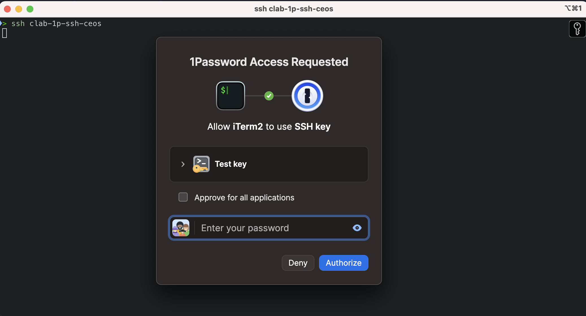

# Using 1Password ssh-agent for authentication

Use a private key stored in 1Password to authenticate to a switch:

In 1Password:
1) Create a private key in 1password (add -> ssh key -> generate -> edcsa)
2) Enable the 1password ssh agent (settings -> developer -> user the SSH agent)
3) Copy the IdentityAgent snippet

Add your user with public key to the network device:

```
username stimmerman privilege 15 secret *
username stimmerman ssh-key ssh-ed25519 AAAAC3NzaC1lZDI1NTE5AAAAIMxitlzv6h4ubdz4DI8KOW31yf1S/zWwdgnX1/3b3pNV
```

The * means that a password can't be used to login with this user. So only the public key is a valid method:
```
ceos(config)#username stimmerman privilege 15 secret ?
  0       Specify an UNENCRYPTED password will follow
  5       Specify an ENCRYPTED MD5 password will follow
  LINE    The UNENCRYPTED (cleartext) password
  sha512  Specifies an ENCRYPTED SHA512 password will follow
  *       Specify a password that cannot be used to login
```

Add the IdentityAgent config to ~/.ssh/config for example:

```
#####################################
#
#       CONTAINER LAB
#
#####################################

Host clab01
	User stimmerman
	HostName 10.123.0.3
	IdentityFile ~/.ssh/id_rsa_lab
	ForwardAgent yes

Host clab-*
	ProxyJump 10.123.0.3
	StrictHostKeyChecking no
	IdentityAgent "~/Library/Group Containers/XXXX1234XX.com.1password/t/agent.sock"
```
The confiuration above specify's a jumphost, in my case `clab01` because that's were the lab is running. And the specify's to use the jumphost for every host starting with `clab-*`, which in this lab is the Arista EOS switch `clab-1p-ssh-ceos`

This results in the following if your vault is locked:



